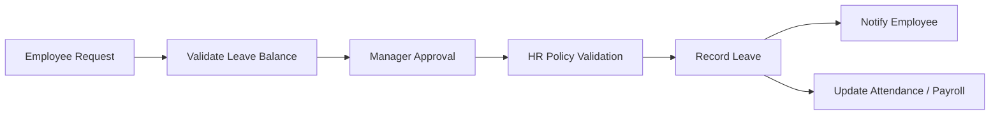
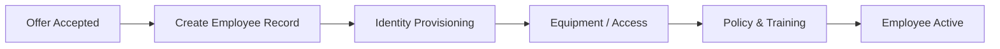

# Business Processes

## Employee Leave Process



## Employee Onboarding



## Performance Review

```text
Set Goals
   ↓
Periodic Check-in
   ↓
Employee Self-Assessment
   ↓
Manager Assessment
   ↓
Calibration
   ↓
Final Review
   ↓
Development Plan
```

## Process Improvement Targets

- Digital workflow
- Policy validation
- Automated notifications
- Audit trail
- Reduced manual handoffs
- Reusable business services
