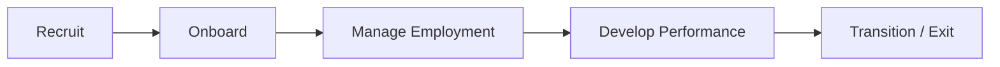
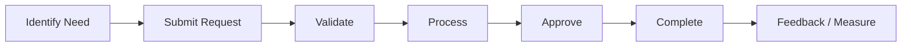

# Value Streams

## Employee Lifecycle Value Stream

## Employee Service Value Stream

## Value Stream Stages and Outcomes

| Stage         | Outcome                                 |
| ------------- | --------------------------------------- |
| Identify Need | Employee knows what service is required |
| Submit        | Digital request captured                |
| Validate      | Policy and eligibility checked          |
| Process       | Responsible team/system performs work   |
| Approve       | Required authorization completed        |
| Complete      | Business record updated                 |
| Measure       | Service performance captured            |
