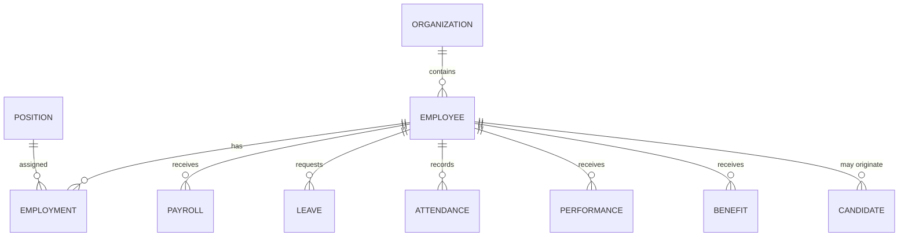

# Data Model

## Conceptual Model



## Logical Model Principles

- Surrogate enterprise identifiers where required.
- Clear ownership of master data.
- Referential integrity.
- Temporal handling for employment and organizational changes.
- Audit fields on critical records.
- Classification of sensitive attributes.
- Separate operational and analytical workloads.

## Data Lifecycle

```text
Create → Validate → Use → Share → Archive → Dispose
```
