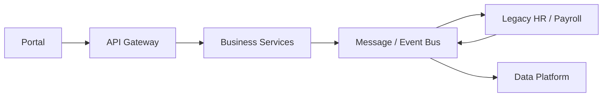

# Integration Architecture

## Target Pattern

## Integration Patterns

| Pattern              | Use                                            |
| -------------------- | ---------------------------------------------- |
| Synchronous REST API | Immediate request/response                     |
| Asynchronous Event   | Decoupled business event                       |
| Batch                | Controlled bulk transfer                       |
| File exchange        | Temporary legacy integration where unavoidable |

## Rule

Prefer governed APIs/events over uncontrolled point-to-point integration.
