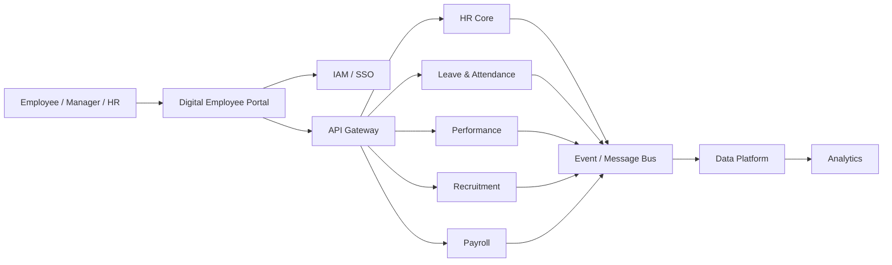

# Application Communication Diagram

## Target Communication View

## Communication Rules

- User-facing applications authenticate through central IAM.
- Business applications expose governed APIs for synchronous interactions.
- Domain events are used where asynchronous decoupling is beneficial.
- Sensitive data must use authenticated and encrypted communication paths.
- Application communication must be observable and auditable.
- Direct database-to-database integration is prohibited unless explicitly approved as a transition exception.
