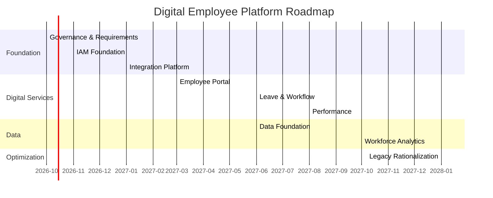

# Architecture Roadmap

```mermaid
gantt
    title Digital Employee Platform Roadmap
    dateFormat  YYYY-MM
    axisFormat  %Y-%m
    section Foundation
    Governance & Requirements :done, g1, 2026-10, 2m
    IAM Foundation :g2, 2026-11, 3m
    Integration Platform :g3, 2027-01, 4m
    section Digital Services
    Employee Portal :g4, 2027-03, 4m
    Leave & Workflow :g5, 2027-06, 4m
    Performance :g6, 2027-08, 3m
    section Data
    Data Foundation :g7, 2027-06, 5m
    Workforce Analytics :g8, 2027-10, 3m
    section Optimization
    Legacy Rationalization :g9, 2028-01, 6m
```

> Timeline is a training assumption and should be replaced by approved project estimates in a real engagement.
