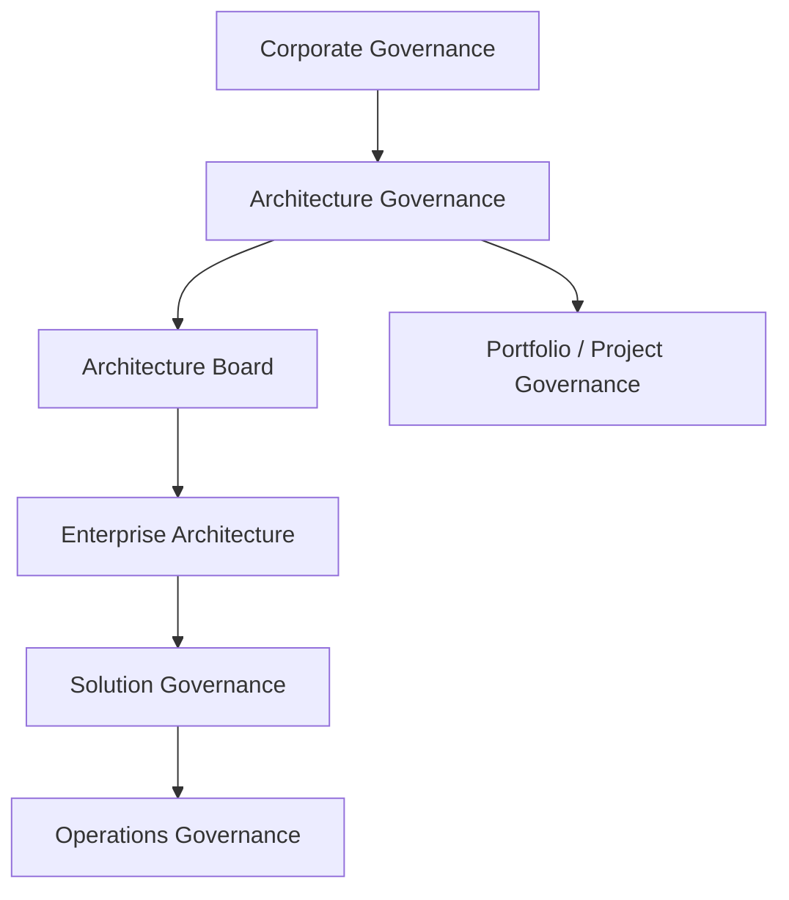

# Architecture Governance Model

## Governance Structure

## Architecture Board

Responsibilities include:

- Architecture discipline
- Consistency across architectures
- Compliance oversight
- Architecture contracts
- Reuse
- Escalation
- Conflict resolution
- Architecture advice
- Dispensation recommendations/decisions within delegated authority
- Policy changes
- Service and cost review

## Decision Right

Business stakeholders retain decision rights for Target Architecture; the Architecture Board governs the architecture decision process and provides recommendations/oversight.
