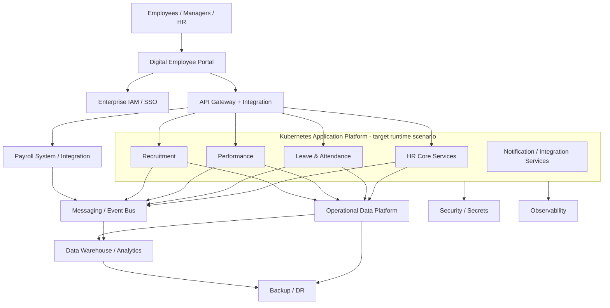

# Enterprise Digital Employee Platform — Complete Enterprise Architecture Project

A portfolio-grade, end-to-end Enterprise Architecture case study using the TOGAF ADM concepts studied in the Palladio TOGAF Foundation material.

> **Source boundary:** TOGAF terminology, ADM phase relationships, architecture domains, Baseline/Target/Transition concepts, artifacts, governance, requirements management and repository concepts are aligned to the supplied study material. The enterprise scenario, business requirements, target design, technology selection, estimates and project decisions are a practical case created for hands-on learning.

## Project Objective

Transform a fragmented employee-services environment into an integrated, secure, scalable and governable Digital Employee Platform.

## Architecture Scope

```text
Enterprise Digital Employee Platform
│
├── 01-project
│   ├── Project Charter
│   ├── Architecture Scope
│   ├── Stakeholders and Concerns
│   ├── Architecture Principles
│   ├── Requirements
│   └── Requirements Impact Assessment
│
├── 02-business-architecture
│   ├── Business Capability Map
│   ├── Business Processes
│   ├── Value Streams
│   └── Organization Model
│
├── 03-data-architecture
│   ├── Information Concepts
│   ├── Data Entities
│   ├── Data Model
│   ├── Data Governance
│   └── Data Security
│
├── 04-application-architecture
│   ├── Application Portfolio
│   ├── Application Services
│   ├── API Catalog
│   ├── Integration Architecture
│   └── Application Communication
│
├── 05-technology-architecture
│   ├── Infrastructure
│   ├── Cloud
│   ├── Kubernetes
│   ├── Runtime
│   ├── Network
│   ├── Security / Observability
│   └── Technology Portfolio
│
├── 06-migration-roadmap
│   ├── Gap Register
│   ├── Work Packages
│   ├── Transition Architectures
│   ├── Architecture Roadmap
│   ├── Implementation and Migration Plan
│   └── Implementation Governance Model
│
├── 07-architecture-governance
├── 08-architecture-repository
│   └── Requirement Traceability
├── 09-architecture-vision
│   ├── Architecture Vision
│   └── Architecture Definition Document
└── 10-final
```

## TOGAF Mapping

| Project Area                    | ADM / TOGAF Relationship                |
| ------------------------------- | --------------------------------------- |
| Project foundation              | Preliminary                             |
| Architecture Vision             | Phase A                                 |
| Business Architecture           | Phase B                                 |
| Data + Application Architecture | Phase C                                 |
| Technology Architecture         | Phase D                                 |
| Opportunities & Solutions       | Phase E                                 |
| Migration Planning              | Phase F                                 |
| Implementation Governance       | Phase G                                 |
| Change Management               | Phase H                                 |
| Requirements                    | Continuous Requirements Management      |
| Repository / Content            | Content & Core Concepts                 |
| Governance                      | Architecture Governance & EA Capability |

## Master Flow

```text
Business Strategy
      ↓
Architecture Vision
      ↓
Business Architecture
      ↓
Data + Application Architecture
      ↓
Technology Architecture
      ↓
Gap Analysis
      ↓
Work Packages
      ↓
Transition Architectures
      ↓
Architecture Roadmap
      ↓
Implementation & Migration Plan
      ↓
Implementation Governance
      ↓
Architecture Change Management
      ↺
Requirements Management — Continuous
```

## Target Architecture at a Glance



> Kubernetes is shown as a runtime boundary, not as the business architecture objective. Final technology selection remains subject to requirements, cost, security, operational maturity, availability and workload trade-offs.

## Definition of Done

- [x] Project charter, scope, stakeholders and principles
- [x] Architecture requirements and Requirements Impact Assessment
- [x] Architecture Vision and Architecture Definition Document
- [x] Business capability, process, value-stream and organization views
- [x] Business Baseline / Target / Gap analysis
- [x] Information concepts, data entities, data model and governance
- [x] Data Baseline / Target / Gap analysis and Data Security Architecture
- [x] Application portfolio, services, APIs and integration architecture
- [x] Application matrices and Application Communication Diagram
- [x] Application Baseline / Target / Gap analysis
- [x] Infrastructure, cloud, Kubernetes, runtime and network architecture
- [x] Security, observability and Technology Portfolio Catalog
- [x] Technology Baseline / Target / Gap analysis
- [x] Consolidated gap register, work packages and Transition Architectures
- [x] Architecture Roadmap and Implementation & Migration Plan
- [x] Implementation Governance Model
- [x] Architecture Governance Model, Architecture Contract and Compliance Assessment
- [x] Architecture Change Management
- [x] Architecture Repository, ADRs, standards and requirement traceability
- [x] Executive Architecture Summary and Final Architecture Review

## Final Status

**Status: Architecture case study complete for portfolio / learning use.**

This is an architecture-level design, not a production implementation. Production delivery would still require detailed solution design, security assessment, capacity/performance testing, cost validation, operational readiness, vendor/service selection and formal project approvals.
