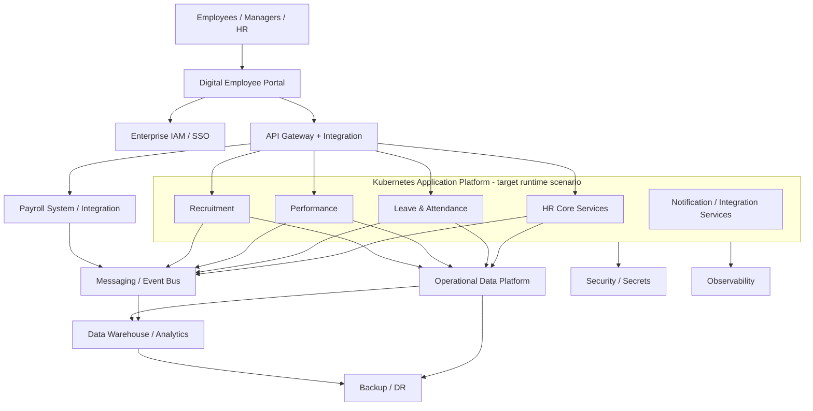
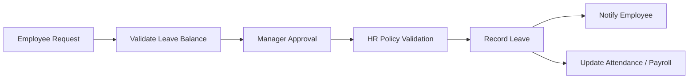
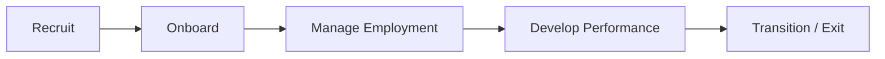
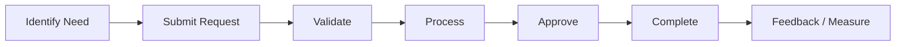
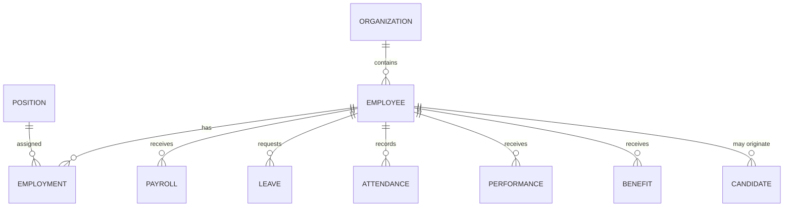
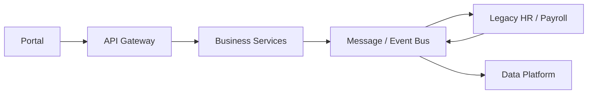
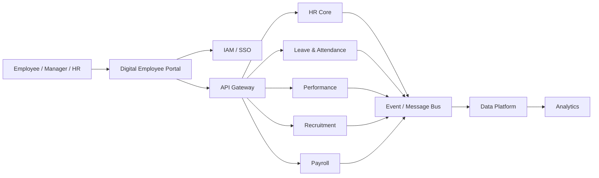
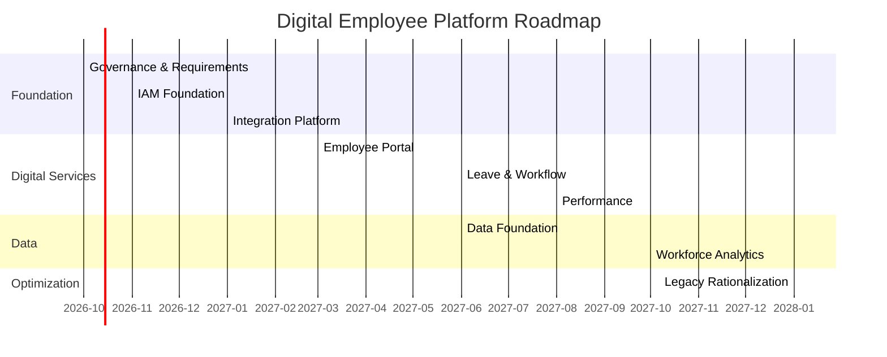
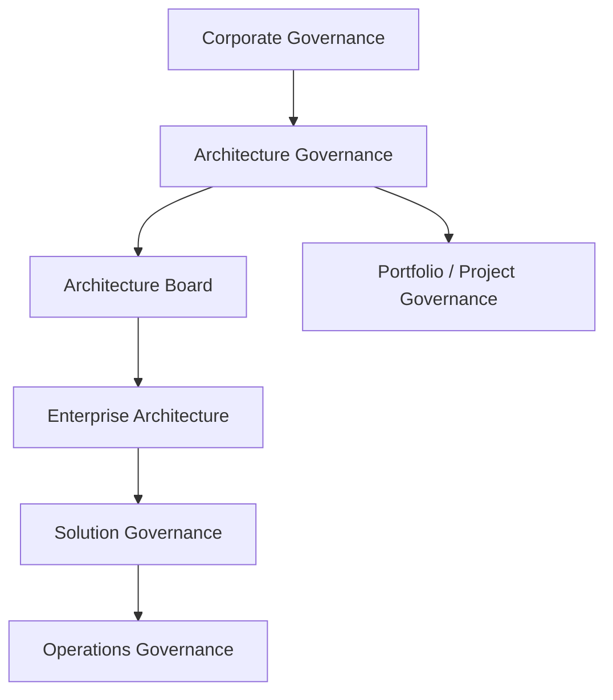

# Enterprise Digital Employee Platform — TOGAF Enterprise Architecture

> **Consolidated single-README edition**

This document consolidates the repository's Markdown architecture documents into one navigable README. Source-document boundaries are retained for traceability.

## Consolidated source index

1. `README.md`
2. `01-project/01-project-charter.md`
3. `01-project/02-architecture-scope.md`
4. `01-project/03-stakeholders.md`
5. `01-project/04-architecture-principles.md`
6. `01-project/05-requirements.md`
7. `01-project/06-requirements-impact-assessment.md`
8. `02-business-architecture/01-business-capability-map.md`
9. `02-business-architecture/02-business-processes.md`
10. `02-business-architecture/03-value-streams.md`
11. `02-business-architecture/04-organization-model.md`
12. `02-business-architecture/05-baseline-target-gap.md`
13. `03-data-architecture/01-information-concepts.md`
14. `03-data-architecture/02-data-entities.md`
15. `03-data-architecture/03-data-model.md`
16. `03-data-architecture/04-data-governance.md`
17. `03-data-architecture/05-baseline-target-gap.md`
18. `03-data-architecture/06-data-security.md`
19. `04-application-architecture/01-application-portfolio.md`
20. `04-application-architecture/02-application-services.md`
21. `04-application-architecture/03-api-catalog.md`
22. `04-application-architecture/04-integration-architecture.md`
23. `04-application-architecture/05-application-matrices.md`
24. `04-application-architecture/06-baseline-target-gap.md`
25. `04-application-architecture/07-application-communication.md`
26. `05-technology-architecture/01-infrastructure.md`
27. `05-technology-architecture/02-cloud.md`
28. `05-technology-architecture/03-kubernetes.md`
29. `05-technology-architecture/04-runtime.md`
30. `05-technology-architecture/05-network.md`
31. `05-technology-architecture/06-security-observability.md`
32. `05-technology-architecture/07-baseline-target-gap.md`
33. `05-technology-architecture/08-technology-portfolio.md`
34. `06-migration-roadmap/01-gap-register.md`
35. `06-migration-roadmap/02-work-packages.md`
36. `06-migration-roadmap/03-transition-architectures.md`
37. `06-migration-roadmap/04-architecture-roadmap.md`
38. `06-migration-roadmap/05-implementation-migration-plan.md`
39. `06-migration-roadmap/06-implementation-governance-model.md`
40. `07-architecture-governance/01-governance-model.md`
41. `07-architecture-governance/02-architecture-contract.md`
42. `07-architecture-governance/03-compliance-assessment.md`
43. `07-architecture-governance/04-change-management.md`
44. `08-architecture-repository/01-repository-structure.md`
45. `08-architecture-repository/02-content-and-artifact-index.md`
46. `08-architecture-repository/03-architecture-decisions.md`
47. `08-architecture-repository/04-standards-library.md`
48. `08-architecture-repository/05-requirement-traceability.md`
49. `09-architecture-vision/01-architecture-vision.md`
50. `09-architecture-vision/02-architecture-definition-document.md`
51. `10-final/01-executive-architecture-summary.md`
52. `10-final/02-final-architecture-review.md`
53. `10-final/03-project-portfolio-checklist.md`

---

# Consolidated Architecture Content


---

## Source Document 1: `README.md`

# Enterprise Digital Employee Platform — Complete Enterprise Architecture Project

A portfolio-grade, end-to-end Enterprise Architecture case study using the TOGAF ADM concepts studied in the Palladio TOGAF Foundation material.

> **Source boundary:** TOGAF terminology, ADM phase relationships, architecture domains, Baseline/Target/Transition concepts, artifacts, governance, requirements management and repository concepts are aligned to the supplied study material. The enterprise scenario, business requirements, target design, technology selection, estimates and project decisions are a practical case created for hands-on learning.

## Project Objective

Transform a fragmented employee-services environment into an integrated, secure, scalable and governable Digital Employee Platform.

## Architecture Scope

```text
Enterprise Digital Employee Platform
│
├── 01-project
│   ├── Project Charter
│   ├── Architecture Scope
│   ├── Stakeholders and Concerns
│   ├── Architecture Principles
│   ├── Requirements
│   └── Requirements Impact Assessment
│
├── 02-business-architecture
│   ├── Business Capability Map
│   ├── Business Processes
│   ├── Value Streams
│   └── Organization Model
│
├── 03-data-architecture
│   ├── Information Concepts
│   ├── Data Entities
│   ├── Data Model
│   ├── Data Governance
│   └── Data Security
│
├── 04-application-architecture
│   ├── Application Portfolio
│   ├── Application Services
│   ├── API Catalog
│   ├── Integration Architecture
│   └── Application Communication
│
├── 05-technology-architecture
│   ├── Infrastructure
│   ├── Cloud
│   ├── Kubernetes
│   ├── Runtime
│   ├── Network
│   ├── Security / Observability
│   └── Technology Portfolio
│
├── 06-migration-roadmap
│   ├── Gap Register
│   ├── Work Packages
│   ├── Transition Architectures
│   ├── Architecture Roadmap
│   ├── Implementation and Migration Plan
│   └── Implementation Governance Model
│
├── 07-architecture-governance
├── 08-architecture-repository
│   └── Requirement Traceability
├── 09-architecture-vision
│   ├── Architecture Vision
│   └── Architecture Definition Document
└── 10-final
```

## TOGAF Mapping

| Project Area                    | ADM / TOGAF Relationship                |
| ------------------------------- | --------------------------------------- |
| Project foundation              | Preliminary                             |
| Architecture Vision             | Phase A                                 |
| Business Architecture           | Phase B                                 |
| Data + Application Architecture | Phase C                                 |
| Technology Architecture         | Phase D                                 |
| Opportunities & Solutions       | Phase E                                 |
| Migration Planning              | Phase F                                 |
| Implementation Governance       | Phase G                                 |
| Change Management               | Phase H                                 |
| Requirements                    | Continuous Requirements Management      |
| Repository / Content            | Content & Core Concepts                 |
| Governance                      | Architecture Governance & EA Capability |

## Master Flow

```text
Business Strategy
      ↓
Architecture Vision
      ↓
Business Architecture
      ↓
Data + Application Architecture
      ↓
Technology Architecture
      ↓
Gap Analysis
      ↓
Work Packages
      ↓
Transition Architectures
      ↓
Architecture Roadmap
      ↓
Implementation & Migration Plan
      ↓
Implementation Governance
      ↓
Architecture Change Management
      ↺
Requirements Management — Continuous
```

## Target Architecture at a Glance



> Kubernetes is shown as a runtime boundary, not as the business architecture objective. Final technology selection remains subject to requirements, cost, security, operational maturity, availability and workload trade-offs.

## Definition of Done

- [x] Project charter, scope, stakeholders and principles
- [x] Architecture requirements and Requirements Impact Assessment
- [x] Architecture Vision and Architecture Definition Document
- [x] Business capability, process, value-stream and organization views
- [x] Business Baseline / Target / Gap analysis
- [x] Information concepts, data entities, data model and governance
- [x] Data Baseline / Target / Gap analysis and Data Security Architecture
- [x] Application portfolio, services, APIs and integration architecture
- [x] Application matrices and Application Communication Diagram
- [x] Application Baseline / Target / Gap analysis
- [x] Infrastructure, cloud, Kubernetes, runtime and network architecture
- [x] Security, observability and Technology Portfolio Catalog
- [x] Technology Baseline / Target / Gap analysis
- [x] Consolidated gap register, work packages and Transition Architectures
- [x] Architecture Roadmap and Implementation & Migration Plan
- [x] Implementation Governance Model
- [x] Architecture Governance Model, Architecture Contract and Compliance Assessment
- [x] Architecture Change Management
- [x] Architecture Repository, ADRs, standards and requirement traceability
- [x] Executive Architecture Summary and Final Architecture Review

## Final Status

**Status: Architecture case study complete for portfolio / learning use.**

This is an architecture-level design, not a production implementation. Production delivery would still require detailed solution design, security assessment, capacity/performance testing, cost validation, operational readiness, vendor/service selection and formal project approvals.


---

## Source Document 2: `01-project/01-project-charter.md`

# Project Charter

## 1. Business Problem

Employee services are distributed across legacy HR, payroll, leave, recruitment and performance systems. The environment has duplicated information, manual workflows, inconsistent interfaces, fragmented reporting and multiple authentication mechanisms.

## 2. Business Drivers

| Driver                 | Desired Outcome                                |
| ---------------------- | ---------------------------------------------- |
| Employee experience    | One consistent digital experience              |
| Operational efficiency | Reduce manual processing                       |
| Data quality           | Establish authoritative employee information   |
| Integration            | Replace uncontrolled point-to-point interfaces |
| Security               | Centralize identity and access                 |
| Analytics              | Improve workforce decision-making              |
| Scalability            | Support organizational growth                  |
| Resilience             | Improve availability and disaster recovery     |

## 3. Objectives

1. Establish a unified digital employee experience.
2. Define authoritative employee information and ownership.
3. Standardize application integration.
4. Establish secure and scalable technology foundations.
5. Reduce manual HR workflows.
6. Provide governed workforce analytics.
7. Create an incremental migration path.
8. Establish architecture governance.

## 4. Scope

### In Scope

- Employee self-service
- Manager self-service
- HR services
- Recruitment
- Payroll integration
- Leave and attendance
- Performance
- Identity and access
- Integration/API platform
- Workforce analytics
- Data architecture
- Technology architecture
- Migration and governance

### Out of Scope

- Customer-facing commerce
- Supply chain
- Finance transformation beyond payroll interfaces
- Physical office infrastructure

## 5. Success Measures

| Measure                                 | Target               |
| --------------------------------------- | -------------------- |
| Common employee services through portal | >= 80%               |
| Manual common HR requests               | -50%                 |
| Employee authentication                 | Central SSO          |
| Critical interfaces                     | Governed APIs/events |
| Authoritative employee record           | Defined              |
| Workforce reporting                     | Standard dashboards  |
| Critical platform availability          | 99.9% target         |


---

## Source Document 3: `01-project/02-architecture-scope.md`

# Architecture Scope

## Scope Dimensions

### Breadth

Enterprise HR and employee-service capabilities.

### Depth

From business capabilities through data, applications and enabling technology.

### Time

Baseline → Transition 1 → Transition 2 → Transition 3 → Target.

### Domains

Business, Data, Application and Technology.

## Architecture States

- **Baseline:** current fragmented employee-service environment.
- **Target:** approved integrated Digital Employee Platform.
- **Transition:** controlled intermediate states between Baseline and Target.
- **Candidate:** potential future state before approval.

## Architecture Boundaries

```text
Enterprise
│
├── HR / People
│   ├── Employee Management
│   ├── Recruitment
│   ├── Leave
│   ├── Performance
│   └── Payroll Integration
│
└── Shared IT
    ├── IAM
    ├── Integration
    ├── Data
    ├── Cloud / Platform
    ├── Security
    └── Operations
```


---

## Source Document 4: `01-project/03-stakeholders.md`

# Stakeholders and Concerns

| Stakeholder          | Primary Concerns             | Architecture View Needed |
| -------------------- | ---------------------------- | ------------------------ |
| Executive Sponsor    | Value, investment, risk      | Vision / Roadmap         |
| CHRO                 | HR capability and experience | Business                 |
| CFO                  | Payroll, cost, control       | Business / Data          |
| CIO                  | Strategy, technology, risk   | Enterprise / Technology  |
| CISO                 | Security, compliance         | Security / Technology    |
| HR Operations        | Process efficiency           | Business / Application   |
| Employees            | Usability, availability      | Business / Application   |
| Managers             | Workforce information        | Business / Data          |
| Enterprise Architect | Coherence and governance     | All domains              |
| Solution Architect   | Solution realization         | Application / Technology |
| Data Owner           | Quality and ownership        | Data                     |
| Platform Team        | Reliability and operations   | Technology               |
| Project Manager      | Scope, cost, schedule        | Roadmap / Governance     |

## Stakeholder Chain

```text
Stakeholder
    ↓
Concern
    ↓
Viewpoint
    ↓
View
```


---

## Source Document 5: `01-project/04-architecture-principles.md`

# Architecture Principles

| ID  | Principle                           | Statement                                                                         | Rationale                                 |
| --- | ----------------------------------- | --------------------------------------------------------------------------------- | ----------------------------------------- |
| P01 | Business Value First                | Architecture decisions must support measurable business outcomes.                 | Prevent technology-driven transformation. |
| P02 | Security by Design                  | Security requirements are addressed throughout architecture development.          | Reduce security risk.                     |
| P03 | Authoritative Data                  | Each critical data domain has defined ownership and authoritative sources.        | Improve quality and accountability.       |
| P04 | Reuse Before Build                  | Reuse suitable existing capabilities and services before creating new ones.       | Reduce cost and duplication.              |
| P05 | API and Integration Standardization | Integration uses governed reusable interfaces and events.                         | Reduce coupling.                          |
| P06 | Incremental Transformation          | Transformation proceeds through manageable transition states.                     | Reduce business disruption.               |
| P07 | Technology Neutrality               | Technology is selected against approved requirements and trade-offs.              | Avoid unnecessary technology bias.        |
| P08 | Observability by Design             | Critical services provide logging, metrics and traceability.                      | Improve operational control.              |
| P09 | Least Privilege                     | Access is granted according to business need.                                     | Reduce security exposure.                 |
| P10 | Resilience by Design                | Critical services include appropriate availability, backup and recovery controls. | Protect business continuity.              |


---

## Source Document 6: `01-project/05-requirements.md`

# Architecture Requirements Baseline

| ID     | Requirement                                             | Domain           | Priority |
| ------ | ------------------------------------------------------- | ---------------- | -------- |
| AR-001 | Provide unified employee self-service                   | Business         | High     |
| AR-002 | Provide manager self-service                            | Business         | High     |
| AR-003 | Automate common HR workflows                            | Business         | High     |
| AR-004 | Establish authoritative employee information            | Data             | High     |
| AR-005 | Define data ownership                                   | Data             | High     |
| AR-006 | Provide governed APIs                                   | Application      | High     |
| AR-007 | Support asynchronous integration where appropriate      | Application      | Medium   |
| AR-008 | Centralize authentication using SSO                     | Technology       | High     |
| AR-009 | Support role-based access control                       | Security         | High     |
| AR-010 | Provide 99.9% target availability for critical services | Technology       | High     |
| AR-011 | Provide monitoring, logging and alerting                | Technology       | High     |
| AR-012 | Provide disaster recovery for critical services         | Technology       | High     |
| AR-013 | Support incremental migration                           | Migration        | High     |
| AR-014 | Maintain auditability                                   | Governance       | High     |
| AR-015 | Provide workforce analytics                             | Data/Application | Medium   |


---

## Source Document 7: `01-project/06-requirements-impact-assessment.md`

# Requirements Impact Assessment

## Purpose

Assess changes to architecture requirements and determine their impact on the current architecture, in-progress ADM work, implementation scope, and future ADM cycles.

## Current Assessment

| Requirement | Change / Trigger | Impacted Area | Impact | Response | Status |
| ----------- | ---------------- | ------------- | ------ | -------- | ------ |
| AR-006 | API governance becomes mandatory for all new integrations | Application / Technology | High | Enforce API standards, lifecycle and review gates | Open |
| AR-008 | Enterprise SSO is required for all employee-facing services | Application / Security | High | Central IAM and migration of legacy authentication | Open |
| AR-010 | Critical-service availability target set at 99.9% | Technology / Operations | High | Multi-zone design, monitoring, backup and DR testing | Open |
| AR-012 | Formal DR capability required for critical services | Technology / Migration | High | Define RPO/RTO, backup and recovery tests | Open |
| AR-013 | Migration must avoid business disruption | Migration | High | Use transition architectures and incremental cutover | Open |

## Impact Assessment Method

```text
Changed Requirement
        ↓
Identify affected stakeholders
        ↓
Assess impact on current / target architecture
        ↓
Assess impact on ADM phase and roadmap
        ↓
Update requirements and affected artifacts
        ↓
Record decision / action
        ↓
Update repository and traceability
```

## Impacted Artifacts

- Architecture Vision
- Business / Data / Application / Technology Baseline and Target views
- Gap Register
- Work Packages
- Transition Architectures
- Architecture Roadmap
- Implementation and Migration Plan
- Architecture Contract / Compliance Assessment

## Requirements Impact Statement

The current assessment confirms that security, availability, integration governance and incremental migration requirements materially influence the target architecture and roadmap. These requirements must remain traceable through implementation governance and future architecture change cycles.

## Governance Rule

Requirements Management remains continuous. A material requirement change must trigger an impact assessment before affected architecture decisions, work packages or implementation plans are approved.


---

## Source Document 8: `02-business-architecture/01-business-capability-map.md`

# Business Capability Map

## Capability Hierarchy

```text
Enterprise People Management
│
├── Strategic
│   ├── Workforce Planning
│   └── Talent Strategy
│
├── Core
│   ├── Employee Management
│   ├── Recruitment
│   ├── Onboarding
│   ├── Payroll Management
│   ├── Leave & Attendance
│   ├── Performance Management
│   └── Employee Self-Service
│
└── Supporting
    ├── Identity & Access Management
    ├── Workforce Analytics
    ├── Document Management
    ├── Audit & Compliance
    └── HR Knowledge Management
```

## Capability Assessment

| Capability            | Baseline | Target      |
| --------------------- | -------- | ----------- |
| Employee Management   | Medium   | High        |
| Recruitment           | Medium   | High        |
| Onboarding            | Low      | High        |
| Payroll Management    | Medium   | High        |
| Leave & Attendance    | Medium   | High        |
| Performance           | Low      | High        |
| Employee Self-Service | Low      | High        |
| IAM                   | Low      | High        |
| Workforce Analytics   | Low      | Medium/High |
| Audit & Compliance    | Medium   | High        |


---

## Source Document 9: `02-business-architecture/02-business-processes.md`

# Business Processes

## Employee Leave Process



## Employee Onboarding


## Performance Review

```text
Set Goals
   ↓
Periodic Check-in
   ↓
Employee Self-Assessment
   ↓
Manager Assessment
   ↓
Calibration
   ↓
Final Review
   ↓
Development Plan
```

## Process Improvement Targets

- Digital workflow
- Policy validation
- Automated notifications
- Audit trail
- Reduced manual handoffs
- Reusable business services


---

## Source Document 10: `02-business-architecture/03-value-streams.md`

# Value Streams

## Employee Lifecycle Value Stream



## Employee Service Value Stream



## Value Stream Stages and Outcomes

| Stage         | Outcome                                 |
| ------------- | --------------------------------------- |
| Identify Need | Employee knows what service is required |
| Submit        | Digital request captured                |
| Validate      | Policy and eligibility checked          |
| Process       | Responsible team/system performs work   |
| Approve       | Required authorization completed        |
| Complete      | Business record updated                 |
| Measure       | Service performance captured            |


---

## Source Document 11: `02-business-architecture/04-organization-model.md`

# Organization Model

```text
CEO / Executive Sponsor
│
├── HR / CHRO
│   ├── HR Operations
│   ├── Talent Acquisition
│   ├── Learning & Development
│   └── Compensation & Benefits
│
├── Finance / CFO
│   └── Payroll
│
└── CIO / IT
    ├── Enterprise Architecture
    ├── Applications
    ├── Data
    ├── Platform / Infrastructure
    ├── Cybersecurity
    └── Service Operations
```

## Architecture Responsibilities

| Role                 | Responsibility                 |
| -------------------- | ------------------------------ |
| Business Owner       | Business outcome               |
| Capability Owner     | Capability performance         |
| Process Owner        | Process design and performance |
| Data Owner           | Data definition and quality    |
| Application Owner    | Application lifecycle          |
| Technology Owner     | Platform lifecycle             |
| Enterprise Architect | Enterprise coherence           |


---

## Source Document 12: `02-business-architecture/05-baseline-target-gap.md`

# Baseline, Target and Gap Analysis

## Baseline

- Multiple employee-service channels
- Manual approvals
- Duplicated employee information
- Separate credentials
- Fragmented reporting
- Point-to-point integrations

## Target

- Unified digital portal
- Standardized workflows
- Authoritative employee information
- Central IAM
- Governed APIs/events
- Workforce analytics

## Business Gap Register

| ID    | Baseline             | Target         | Gap                | Priority |
| ----- | -------------------- | -------------- | ------------------ | -------- |
| BG-01 | Multiple channels    | Unified portal | Experience         | High     |
| BG-02 | Manual approvals     | Workflow       | Process automation | High     |
| BG-03 | Fragmented ownership | Data ownership | Governance         | High     |
| BG-04 | Multiple credentials | SSO            | Identity           | High     |
| BG-05 | Manual reports       | Analytics      | Information        | High     |


---

## Source Document 13: `03-data-architecture/01-information-concepts.md`

# Information Concepts

## Core Information Concepts

```text
Employee
├── Employment
├── Organization
├── Position
├── Manager
├── Payroll
├── Leave
├── Attendance
├── Performance
├── Benefits
└── Recruitment History
```

## Information Ownership

| Information       | Business Owner  | Authoritative System |
| ----------------- | --------------- | -------------------- |
| Employee Identity | HR              | HR Core              |
| Organization      | HR              | HR Core              |
| Position          | HR              | HR Core              |
| Payroll           | Finance/Payroll | Payroll              |
| Leave             | HR              | Leave Service        |
| Attendance        | HR              | Attendance Service   |
| Performance       | HR              | Performance Service  |
| Candidate         | HR              | Recruitment          |


---

## Source Document 14: `03-data-architecture/02-data-entities.md`

# Data Entities

| Entity       | Key Attributes                         | Owner   | Sensitivity         |
| ------------ | -------------------------------------- | ------- | ------------------- |
| Employee     | employee_id, name, status              | HR      | Confidential        |
| Organization | org_id, name, parent                   | HR      | Internal            |
| Position     | position_id, title, grade              | HR      | Internal            |
| Employment   | employee_id, start, end, type          | HR      | Confidential        |
| Payroll      | employee_id, period, gross, net        | Payroll | Highly Confidential |
| Leave        | leave_id, employee_id, type, dates     | HR      | Confidential        |
| Attendance   | employee_id, date, status              | HR      | Confidential        |
| Performance  | employee_id, goals, rating             | HR      | Highly Confidential |
| Candidate    | candidate_id, status, application      | HR      | Confidential        |
| Benefit      | employee_id, benefit_type, eligibility | HR      | Confidential        |


---

## Source Document 15: `03-data-architecture/03-data-model.md`

# Data Model

## Conceptual Model



## Logical Model Principles

- Surrogate enterprise identifiers where required.
- Clear ownership of master data.
- Referential integrity.
- Temporal handling for employment and organizational changes.
- Audit fields on critical records.
- Classification of sensitive attributes.
- Separate operational and analytical workloads.

## Data Lifecycle

```text
Create → Validate → Use → Share → Archive → Dispose
```


---

## Source Document 16: `03-data-architecture/04-data-governance.md`

# Data Governance

## Governance Model

```text
Data Governance Board
       │
       ├── Data Owners
       ├── Data Stewards
       ├── Security
       ├── Enterprise Architecture
       └── Data Engineering
```

## Controls

- Data ownership
- Data classification
- Quality rules
- Access controls
- Retention
- Auditability
- Metadata
- Data lineage
- Master/reference data governance

## Data Quality Dimensions

| Dimension    | Example                               |
| ------------ | ------------------------------------- |
| Accuracy     | Correct employee information          |
| Completeness | Required fields populated             |
| Consistency  | Same employee identity across systems |
| Timeliness   | Updates propagated promptly           |
| Uniqueness   | No duplicate employee master          |
| Validity     | Values satisfy defined rules          |


---

## Source Document 17: `03-data-architecture/05-baseline-target-gap.md`

# Data Baseline / Target / Gap

## Baseline

Multiple databases contain overlapping employee information. Reporting requires manual reconciliation.

## Target

A governed information architecture with authoritative sources, reusable APIs/events and an analytical data platform.

## Gap Register

| ID    | Gap                     | Response                 |
| ----- | ----------------------- | ------------------------ |
| DG-01 | Duplicate employee data | Master data governance   |
| DG-02 | Unclear ownership       | Data ownership model     |
| DG-03 | Manual reconciliation   | Automated integration    |
| DG-04 | Weak lineage            | Metadata and lineage     |
| DG-05 | Fragmented analytics    | Enterprise data platform |


---

## Source Document 18: `03-data-architecture/06-data-security.md`

# Data Security Architecture

## Security View

```text
Users / Services
       ↓
Authentication + Authorization
       ↓
API / Service Layer
       ↓
Encrypted Data Access
       ↓
Operational Data
       ↓
Analytics / Reporting
```

## Controls

| Area | Control |
| ---- | ------- |
| Classification | Confidentiality classification for sensitive employee information |
| Access | Least privilege and role-based access |
| Encryption | TLS in transit and encryption at rest |
| Secrets | Central secrets management |
| Audit | Access and administrative activity logging |
| Retention | Defined retention and disposal rules |
| Analytics | Controlled access to sensitive workforce data |
| Backup | Protected and access-controlled backups |

## Key Principle

Data security requirements apply across the full lifecycle: collection, storage, processing, sharing, analytics, archival and disposal.


---

## Source Document 19: `04-application-architecture/01-application-portfolio.md`

# Application Portfolio

## Baseline

| ID      | Application             | Function                | Disposition                    |
| ------- | ----------------------- | ----------------------- | ------------------------------ |
| APP-B01 | Legacy HRMS             | Employee administration | Modernize / retain temporarily |
| APP-B02 | Payroll                 | Payroll                 | Retain / integrate             |
| APP-B03 | Leave System            | Leave                   | Replace / modernize            |
| APP-B04 | Recruitment             | Recruitment             | Retain / integrate             |
| APP-B05 | Performance             | Performance             | Replace / modernize            |
| APP-B06 | Email / Manual Workflow | Approval                | Retire                         |
| APP-B07 | Spreadsheet Reporting   | Reporting               | Retire                         |

## Target

| ID      | Application                | Capability           |
| ------- | -------------------------- | -------------------- |
| APP-T01 | Digital Employee Portal    | Employee experience  |
| APP-T02 | IAM                        | Identity             |
| APP-T03 | HR Core Services           | Employee master      |
| APP-T04 | Leave & Attendance         | Leave/attendance     |
| APP-T05 | Performance                | Performance          |
| APP-T06 | Recruitment                | Recruitment          |
| APP-T07 | Payroll Integration        | Payroll connectivity |
| APP-T08 | API / Integration Platform | Integration          |
| APP-T09 | Data Platform              | Analytics data       |
| APP-T10 | Workforce Analytics        | Reporting            |


---

## Source Document 20: `04-application-architecture/02-application-services.md`

# Application Services

| Service          | Provider             | Consumers             |
| ---------------- | -------------------- | --------------------- |
| Employee Profile | HR Core              | Portal, HR, Analytics |
| Organization     | HR Core              | Portal, Analytics     |
| Leave Balance    | Leave Service        | Portal, Manager       |
| Leave Request    | Leave Service        | Employee, Manager     |
| Attendance       | Attendance Service   | HR, Manager           |
| Payroll Summary  | Payroll Integration  | Employee, HR          |
| Performance      | Performance Service  | Employee, Manager, HR |
| Recruitment      | Recruitment Service  | Recruiter, Manager    |
| Identity         | IAM                  | All applications      |
| Notification     | Notification Service | Business services     |
| Reporting        | Analytics            | Management, HR        |

## Service Design Principles

- Business capability aligned
- Reusable
- Governed
- Secure
- Observable
- Versioned


---

## Source Document 21: `04-application-architecture/03-api-catalog.md`

# API Catalog

| API              | Method Examples | Purpose                | Consumer           |
| ---------------- | --------------- | ---------------------- | ------------------ |
| Employee API     | GET/PATCH       | Employee profile       | Portal             |
| Organization API | GET             | Organization hierarchy | Portal / Analytics |
| Leave API        | GET/POST        | Leave operations       | Portal             |
| Attendance API   | GET             | Attendance             | Portal / HR        |
| Payroll API      | GET             | Payroll summary        | Portal             |
| Performance API  | GET/POST        | Performance data       | Portal             |
| Recruitment API  | GET/POST        | Candidate workflow     | Recruiter          |
| Notification API | POST            | Notifications          | Services           |

## API Governance

- Authentication and authorization
- API versioning
- Rate limiting
- Schema validation
- Logging
- Monitoring
- Documentation
- Lifecycle management


---

## Source Document 22: `04-application-architecture/04-integration-architecture.md`

# Integration Architecture

## Target Pattern



## Integration Patterns

| Pattern              | Use                                            |
| -------------------- | ---------------------------------------------- |
| Synchronous REST API | Immediate request/response                     |
| Asynchronous Event   | Decoupled business event                       |
| Batch                | Controlled bulk transfer                       |
| File exchange        | Temporary legacy integration where unavoidable |

## Rule

Prefer governed APIs/events over uncontrolled point-to-point integration.


---

## Source Document 23: `04-application-architecture/05-application-matrices.md`

# Application Architecture Matrices

## Application / Organization

| Application | Employee | Manager |   HR | Payroll |   IT |
| ----------- | -------: | ------: | ---: | ------: | ---: |
| Portal      |        X |       X |    X |         |      |
| IAM         |        X |       X |    X |       X |    X |
| HR Core     |          |         |    X |         |    X |
| Leave       |        X |       X |    X |         |      |
| Performance |        X |       X |    X |         |      |
| Recruitment |          |       X |    X |         |      |
| Payroll     |          |         |      |       X |    X |
| Analytics   |          |       X |    X |       X |    X |

## Application / Data

| Application   | Employee | Payroll | Leave | Performance | Recruitment |
| ------------- | -------: | ------: | ----: | ----------: | ----------: |
| HR Core       |        X |         |       |             |             |
| Payroll       |        X |       X |       |             |             |
| Leave         |        X |         |     X |             |             |
| Performance   |        X |         |       |           X |             |
| Recruitment   |        X |         |       |             |           X |
| Data Platform |        X |       X |     X |           X |           X |


---

## Source Document 24: `04-application-architecture/06-baseline-target-gap.md`

# Application Baseline / Target / Gap

| Gap   | Baseline              | Target               | Response          |
| ----- | --------------------- | -------------------- | ----------------- |
| AG-01 | Multiple portals      | One portal           | Portal            |
| AG-02 | Point-to-point        | Integration platform | API/event layer   |
| AG-03 | Email approvals       | Workflow             | Digital workflows |
| AG-04 | Multiple login        | SSO                  | IAM               |
| AG-05 | Spreadsheet reporting | Analytics            | Data platform     |


---

## Source Document 25: `04-application-architecture/07-application-communication.md`

# Application Communication Diagram

## Target Communication View



## Communication Rules

- User-facing applications authenticate through central IAM.
- Business applications expose governed APIs for synchronous interactions.
- Domain events are used where asynchronous decoupling is beneficial.
- Sensitive data must use authenticated and encrypted communication paths.
- Application communication must be observable and auditable.
- Direct database-to-database integration is prohibited unless explicitly approved as a transition exception.


---

## Source Document 26: `05-technology-architecture/01-infrastructure.md`

# Infrastructure Architecture

## Target Infrastructure

```text
Users
  ↓
Internet / Corporate Network
  ↓
Load Balancer / Ingress
  ↓
Kubernetes Cluster
  ├── Portal
  ├── HR Services
  ├── Leave
  ├── Performance
  └── Integration Services
  ↓
Managed Database
  ↓
Data / Analytics Platform
```

## Infrastructure Requirements

- Multi-zone deployment for critical services
- Automated backup
- Infrastructure as Code
- Network segmentation
- Central logging
- Monitoring
- Secrets management
- Disaster recovery


---

## Source Document 27: `05-technology-architecture/02-cloud.md`

# Cloud Architecture

## Target Cloud Pattern

A cloud deployment is used as the target technology scenario for this training project.

```text
Cloud Landing Zone
├── Identity / IAM
├── Network
│   ├── Public / Edge
│   └── Private Application / Data
├── Compute
├── Data
├── Security
├── Observability
└── Backup / DR
```

## Cloud Principles

- Least privilege
- Private-by-default data services
- Multi-zone resilience for critical workloads
- Encryption in transit and at rest
- Centralized logging
- Infrastructure as Code
- Cost tagging
- Automated backup
- Tested recovery

> AWS services can be mapped to this architecture during the technology selection exercise. The architecture does not assume a particular vendor until requirements and trade-offs are reviewed.


---

## Source Document 28: `05-technology-architecture/03-kubernetes.md`

# Kubernetes Architecture

## Target Runtime Scenario

Kubernetes is selected as a target application runtime **for this training scenario**, subject to architecture governance and technology trade-off review.

```text
Ingress
  ↓
API Gateway / Ingress Controller
  ↓
Kubernetes
├── portal
├── hr-service
├── leave-service
├── performance-service
├── recruitment-service
├── notification-service
└── integration-service
  ↓
Managed Data Services
```

## Kubernetes Requirements

- Namespace separation
- Resource requests/limits
- Horizontal scaling
- Pod disruption controls
- Health probes
- Secret management
- Network policies
- Ingress controls
- Central logs/metrics
- Rolling deployment
- Image scanning
- RBAC

## Operational Rule

Kubernetes is an enabling technology, not the architecture objective. Business requirements remain the driver.


---

## Source Document 29: `05-technology-architecture/04-runtime.md`

# Runtime Architecture

## Runtime Layers

| Layer         | Responsibility            |
| ------------- | ------------------------- |
| Edge          | TLS termination / ingress |
| API           | API routing and policy    |
| Application   | Business services         |
| Messaging     | Asynchronous events       |
| Data          | Operational persistence   |
| Analytics     | Reporting workloads       |
| Observability | Logs, metrics, traces     |
| Security      | IAM, secrets, policy      |

## Deployment

```text
Source
 ↓
Git
 ↓
CI
 ↓
Build / Test / Scan
 ↓
Container Image
 ↓
Registry
 ↓
CD
 ↓
Kubernetes
 ↓
Monitoring
```


---

## Source Document 30: `05-technology-architecture/05-network.md`

# Network Architecture

## Logical Network

```text
Internet / Corporate Users
          │
          ▼
      Edge / WAF
          │
          ▼
      Load Balancer
          │
     ┌────┴────┐
     ▼         ▼
 Application  API
 Network      Layer
     │         │
     └────┬────┘
          ▼
       Data Network
          │
     ┌────┴────┐
     ▼         ▼
   Database   Messaging
```

## Network Principles

- Segment edge, application and data tiers.
- Do not expose databases directly to users.
- Restrict east-west traffic.
- Use TLS for sensitive communications.
- Centralize network monitoring.
- Apply least-privilege connectivity.


---

## Source Document 31: `05-technology-architecture/06-security-observability.md`

# Security and Observability

## Security Controls

| Area          | Control                                      |
| ------------- | -------------------------------------------- |
| Identity      | SSO + MFA where applicable                   |
| Authorization | RBAC / least privilege                       |
| Secrets       | Central secrets management                   |
| Data          | Encryption                                   |
| API           | Authentication, authorization, rate limiting |
| Container     | Image scanning                               |
| Network       | Segmentation and policy                      |
| Audit         | Central audit logging                        |
| Backup        | Protected backups                            |

## Observability

```text
Metrics ─┐
Logs ────┼──→ Observability Platform → Alerts / Dashboards
Traces ──┘
```

## Key Metrics

- Availability
- Latency
- Error rate
- Request volume
- Resource utilization
- Authentication failures
- Integration failures
- Queue depth


---

## Source Document 32: `05-technology-architecture/07-baseline-target-gap.md`

# Technology Baseline / Target / Gap

| ID    | Baseline               | Target                     | Gap          |
| ----- | ---------------------- | -------------------------- | ------------ |
| TG-01 | Fragmented identity    | Central IAM                | Identity     |
| TG-02 | Point-to-point         | API/event platform         | Integration  |
| TG-03 | Limited monitoring     | Full observability         | Operations   |
| TG-04 | Manual deployments     | CI/CD                      | Delivery     |
| TG-05 | Single-site dependency | Resilient deployment       | Availability |
| TG-06 | Inconsistent security  | Standard security controls | Security     |


---

## Source Document 33: `05-technology-architecture/08-technology-portfolio.md`

# Technology Portfolio Catalog

## Baseline Technology Portfolio

| Technology Capability | Baseline State | Target Direction | Disposition |
| --------------------- | -------------- | ---------------- | ----------- |
| Compute | Fragmented / legacy servers | Standardized cloud compute | Modernize |
| Network | Segmented inconsistently | Layered network with controlled connectivity | Modernize |
| Identity | Multiple authentication mechanisms | Central IAM / SSO | Replace / consolidate |
| Runtime | Mixed application runtimes | Standardized container runtime | Standardize |
| Data Platform | Multiple operational databases | Governed operational + analytical platform | Modernize |
| Integration | Point-to-point | API gateway + event integration | Replace |
| Observability | Tool-specific monitoring | Central logs, metrics and traces | Standardize |
| Backup / DR | Inconsistent recovery controls | Defined RPO/RTO and tested recovery | Strengthen |

## Target Technology Capabilities

- Cloud landing zone
- Network segmentation
- Managed or standardized compute
- Kubernetes application platform where justified
- Managed data services
- API gateway and messaging
- Central secrets management
- Central observability
- Backup and disaster recovery
- Infrastructure as Code

## Selection Rule

Technology products and services are implementation choices. Final selection must be validated against requirements, security, cost, skills, operational maturity, availability, performance and workload characteristics.


---

## Source Document 34: `06-migration-roadmap/01-gap-register.md`

# Consolidated Architecture Gap Register

| ID    | Domain      | Gap                          | Priority | Work Package |
| ----- | ----------- | ---------------------------- | -------- | ------------ |
| BG-01 | Business    | Fragmented employee channels | High     | WP-03        |
| BG-02 | Business    | Manual workflows             | High     | WP-04        |
| DG-01 | Data        | Duplicate employee records   | High     | WP-05        |
| DG-02 | Data        | Unclear ownership            | High     | WP-05        |
| AG-01 | Application | Multiple portals             | High     | WP-03        |
| AG-02 | Application | Point-to-point interfaces    | High     | WP-02        |
| TG-01 | Technology  | No central IAM               | High     | WP-01        |
| TG-02 | Technology  | Limited observability        | High     | WP-06        |
| TG-03 | Technology  | Weak DR                      | High     | WP-07        |
| TG-04 | Technology  | Manual deployment            | Medium   | WP-06        |


---

## Source Document 35: `06-migration-roadmap/02-work-packages.md`

# Work Packages

| ID    | Work Package           | Main Deliverables                | Dependencies |
| ----- | ---------------------- | -------------------------------- | ------------ |
| WP-01 | IAM Foundation         | SSO, RBAC, MFA integration       | Governance   |
| WP-02 | Integration Foundation | API gateway, event bus           | IAM          |
| WP-03 | Digital Portal         | Employee/manager portal          | IAM, API     |
| WP-04 | Workflow Automation    | Leave and HR workflows           | Portal, API  |
| WP-05 | Data Foundation        | Data model, quality, warehouse   | API          |
| WP-06 | Platform Engineering   | Kubernetes, CI/CD, observability | Cloud        |
| WP-07 | Resilience             | Backup, DR, recovery testing     | Platform     |
| WP-08 | Legacy Rationalization | Retirement / migration           | WP-03–07     |


---

## Source Document 36: `06-migration-roadmap/03-transition-architectures.md`

# Transition Architectures

## TA-1 — Integration Foundation

```text
Existing HR / Payroll
       │
       ▼
Integration Platform
       │
       ▼
Initial Digital Portal
       │
       ▼
Central IAM
```

Outcome: controlled integration and unified access.

## TA-2 — Digital HR Services

Add:

- Leave
- Attendance
- Workflow
- Notifications
- Manager services

Outcome: major reduction in manual HR processing.

## TA-3 — Data and Analytics

Add:

- Governed data model
- Data quality controls
- Data warehouse
- Workforce dashboards

Outcome: trusted workforce information.

## TA-4 — Target State

- Unified portal
- Governed services
- Integrated legacy systems where still required
- Rationalized applications
- Scalable platform
- Governance and observability


---

## Source Document 37: `06-migration-roadmap/04-architecture-roadmap.md`

# Architecture Roadmap



> Timeline is a training assumption and should be replaced by approved project estimates in a real engagement.


---

## Source Document 38: `06-migration-roadmap/05-implementation-migration-plan.md`

# Implementation and Migration Plan

## Prioritization Model

Priority considers:

- Business value
- Cost
- Risk
- Dependencies
- Resource availability
- Stakeholder priorities
- Transition complexity

## Project Portfolio

| Project                | Value  | Effort | Risk   | Priority |
| ---------------------- | ------ | ------ | ------ | -------: |
| IAM                    | High   | Medium | Medium |        1 |
| Integration Platform   | High   | High   | High   |        2 |
| Portal                 | High   | High   | Medium |        3 |
| Workflow               | High   | Medium | Medium |        4 |
| Data Foundation        | High   | High   | High   |        5 |
| Analytics              | Medium | Medium | Medium |        6 |
| Legacy Rationalization | Medium | High   | High   |        7 |

## Migration Governance

Each project must have:

- Objectives
- Scope
- Architecture requirements
- Dependencies
- Resources
- Risks
- Benefits
- Cost
- Start / finish target
- Architecture compliance checkpoints


---

## Source Document 39: `06-migration-roadmap/06-implementation-governance-model.md`

# Implementation Governance Model

## Purpose

Define how architecture governance will continue during implementation so that projects realize the approved architecture and deviations are controlled.

## Governance Flow

```text
Approved Architecture
        ↓
Architecture Contract
        ↓
Solution / Project Design
        ↓
Architecture Compliance Review
        ↓
Implementation Decision
        ↓
Delivery Monitoring
        ↓
Exception / Change Request when required
```

## Governance Responsibilities

| Role | Responsibility |
| ---- | -------------- |
| Architecture Board | Approves major architecture decisions and exceptions within delegated authority |
| Enterprise Architect | Maintains architecture integrity and resolves cross-domain issues |
| Solution Architect | Ensures solution design conforms to target architecture |
| Project Manager | Tracks delivery scope, dependencies, risks and governance checkpoints |
| Security / CISO | Reviews security and compliance requirements |
| Data Owner | Approves data ownership, quality and access decisions |
| Platform / Operations | Validates reliability, observability, resilience and operational readiness |

## Compliance Checkpoints

1. Solution architecture approval before implementation.
2. Security and data review before production readiness.
3. Architecture compliance assessment during delivery.
4. Exception approval before material deviation.
5. Operational readiness review before go-live.
6. Post-implementation architecture review.

## Exception Rule

A project must not silently deviate from an approved architecture. Material deviations require a documented impact assessment and an approved architecture change or dispensation according to governance authority.


---

## Source Document 40: `07-architecture-governance/01-governance-model.md`

# Architecture Governance Model

## Governance Structure



## Architecture Board

Responsibilities include:

- Architecture discipline
- Consistency across architectures
- Compliance oversight
- Architecture contracts
- Reuse
- Escalation
- Conflict resolution
- Architecture advice
- Dispensation recommendations/decisions within delegated authority
- Policy changes
- Service and cost review

## Decision Right

Business stakeholders retain decision rights for Target Architecture; the Architecture Board governs the architecture decision process and provides recommendations/oversight.


---

## Source Document 41: `07-architecture-governance/02-architecture-contract.md`

# Architecture Contract

## Purpose

Establish agreement between architecture sponsors, development partners and implementers regarding architecture delivery and conformance.

## Contract Content

- Background
- Nature of agreement
- Architecture scope
- Strategic principles
- Architecture requirements
- Conformance requirements
- Roles and responsibilities
- Development and management process
- Target Architecture measures
- Deliverables
- Joint workplan
- Time windows
- Business and architecture metrics

## Compliance Rule

Implementation teams must demonstrate conformance to approved architecture or obtain an approved exception/change decision.


---

## Source Document 42: `07-architecture-governance/03-compliance-assessment.md`

# Architecture Compliance Assessment

## Review

```text
Project Scope
   ↓
Approved Target Architecture
   ↓
Architecture Requirements
   ↓
Design Review
   ↓
Implementation Review
   ↓
Compliance Result
```

## Review Areas

- Business capability
- Data model and ownership
- Application architecture
- API/integration
- Technology platform
- Security
- Resilience
- Operations
- Standards

## Outcome

| Result                | Decision                  |
| --------------------- | ------------------------- |
| Compliant             | Continue                  |
| Minor deviation       | Correct or document       |
| Major deviation       | Architecture Board review |
| Architecture obsolete | Change Request            |


---

## Source Document 43: `07-architecture-governance/04-change-management.md`

# Architecture Change Management

## Change Process

```text
New Fact / Requirement / Technology / Strategy
                 ↓
           Change Request
                 ↓
          Impact Assessment
                 ↓
          Change Classification
                 ↓
        Governance Decision
          ↙      ↓       ↘
 Simplification Incremental Re-architecting
          ↓      ↓       ↓
 Change Mgmt Partial     New ADM Cycle
                 ↓
          Updated Architecture
```

## Example

CR-001: Enterprise introduces a new biometric attendance platform.

Potential impact:

- Business process
- Employee data
- Attendance application
- Integration APIs
- Security/privacy
- Technology

Classification: **Incremental change**, subject to formal impact assessment.


---

## Source Document 44: `08-architecture-repository/01-repository-structure.md`

# Architecture Repository

## Repository Structure

```text
Architecture Repository
│
├── Architecture Framework / Content Metamodel
├── Governance Repository
├── Architecture Landscape
├── Standards Library
├── Reference Library
├── Architecture Requirements Repository
├── Solutions Landscape
└── Governance Log
```

## Project Mapping

| Repository Area         | Project Content                              |
| ----------------------- | -------------------------------------------- |
| Architecture Landscape  | Baseline / Target / Transition architectures |
| Requirements Repository | Requirements / Impact Assessments            |
| Standards Library       | Security / Technology standards              |
| Reference Library       | Reusable reference architectures             |
| Solutions Landscape     | Candidate and approved solutions             |
| Governance Repository   | Governance models / contracts                |
| Governance Log          | Decisions / reviews / compliance             |

## Enterprise Continuum

Architecture and solution assets can be classified from generic concepts toward organization-specific solutions to support reuse and specialization.


---

## Source Document 45: `08-architecture-repository/02-content-and-artifact-index.md`

# Content and Artifact Index

| Artifact | Domain | Phase / Relationship | Project Location |
| --- | --- | --- | --- |
| Architecture Principles | Cross-domain | Preliminary | `01-project/04-architecture-principles.md` |
| Architecture Vision | Cross-domain | A | `09-architecture-vision/01-architecture-vision.md` |
| Architecture Definition Document | Cross-domain | A | `09-architecture-vision/02-architecture-definition-document.md` |
| Statement of Architecture Work | Cross-domain | A | Included in Architecture Vision |
| Requirements Impact Assessment | Cross-domain | Continuous | `01-project/06-requirements-impact-assessment.md` |
| Business Capability Map | Business | B | `02-business-architecture/01-business-capability-map.md` |
| Business Process | Business | B | `02-business-architecture/02-business-processes.md` |
| Value Stream | Business | B | `02-business-architecture/03-value-streams.md` |
| Data Entity Catalog | Data | C | `03-data-architecture/02-data-entities.md` |
| Conceptual / Logical Data Model | Data | C | `03-data-architecture/03-data-model.md` |
| Data Security Architecture | Data | C | `03-data-architecture/06-data-security.md` |
| Application Portfolio Catalog | Application | C | `04-application-architecture/01-application-portfolio.md` |
| Application Communication Diagram | Application | C | `04-application-architecture/07-application-communication.md` |
| Application / Data Matrix | Application / Data | C | `04-application-architecture/05-application-matrices.md` |
| Technology Portfolio Catalog | Technology | D | `05-technology-architecture/08-technology-portfolio.md` |
| Platform / Runtime Architecture | Technology | D | `05-technology-architecture/03-kubernetes.md`, `04-runtime.md` |
| Network Architecture | Technology | D | `05-technology-architecture/05-network.md` |
| Architecture Roadmap | Cross-domain | E | `06-migration-roadmap/04-architecture-roadmap.md` |
| Implementation & Migration Plan | Cross-domain | E/F | `06-migration-roadmap/05-implementation-migration-plan.md` |
| Implementation Governance Model | Cross-domain | F | `06-migration-roadmap/06-implementation-governance-model.md` |
| Architecture Contract | Governance | G | `07-architecture-governance/02-architecture-contract.md` |
| Compliance Assessment | Governance | G | `07-architecture-governance/03-compliance-assessment.md` |
| Change Management | Governance / Change | H | `07-architecture-governance/04-change-management.md` |
| Architecture Decision Records | Repository / Governance | Cross-cutting | `08-architecture-repository/03-architecture-decisions.md` |
| Requirement Traceability Matrix | Cross-domain | Continuous / Repository | `08-architecture-repository/05-requirement-traceability.md` |


---

## Source Document 46: `08-architecture-repository/03-architecture-decisions.md`

# Architecture Decision Records

## ADR-001 — Unified Employee Portal

**Decision:** Create a single digital employee experience.

**Alternatives:** Separate portals / single portal.

**Reason:** Better user experience and reduced channel fragmentation.

## ADR-002 — API + Event Integration

**Decision:** Use governed APIs for synchronous needs and events for suitable asynchronous integration.

**Reason:** Reduce coupling and support reusable integration.

## ADR-003 — Kubernetes Runtime

**Decision:** Use Kubernetes as the target runtime scenario for this training architecture.

**Reason:** Supports containerized services, controlled deployment, scaling and platform standardization.

**Condition:** Final production selection remains subject to cost, skills, operational maturity, security, availability and workload trade-off analysis.

## ADR-004 — Central IAM

**Decision:** Centralize identity and access.

**Reason:** Consistent authentication, authorization and auditability.

## ADR-005 — Incremental Migration

**Decision:** Use Transition Architectures rather than a big-bang replacement.

**Reason:** Reduce business disruption and manage legacy dependencies.


---

## Source Document 47: `08-architecture-repository/04-standards-library.md`

# Standards Library

## Application

- REST API conventions
- API versioning
- OpenAPI documentation
- Secure coding standards

## Data

- Naming standards
- Data classification
- Schema governance
- Retention rules
- Data quality standards

## Technology

- Container standards
- Kubernetes security baseline
- Network segmentation
- TLS
- Backup and recovery
- Infrastructure as Code

## Security

- Least privilege
- RBAC
- MFA where applicable
- Secrets management
- Central audit logging
- Vulnerability management


---

## Source Document 48: `08-architecture-repository/05-requirement-traceability.md`

# Requirement Traceability Matrix

| Requirement | Primary Architecture Response | Implementation / Governance Response |
| ----------- | ----------------------------- | ------------------------------------- |
| AR-001 Unified self-service | Digital Employee Portal | Portal work package and adoption KPI |
| AR-002 Manager self-service | Portal + manager capabilities | Business process validation |
| AR-003 HR workflow automation | Workflow-enabled services | Transition architecture / compliance review |
| AR-004 Authoritative employee information | HR Core + data ownership | Data governance |
| AR-005 Data ownership | Data Owners / Stewards | Data Governance Board |
| AR-006 Governed APIs | API Gateway + API catalog | Architecture contract |
| AR-007 Asynchronous integration | Event / Message Bus | Integration standards |
| AR-008 Central SSO | Enterprise IAM | Security review |
| AR-009 RBAC | IAM + application authorization | Compliance assessment |
| AR-010 99.9% availability | Multi-zone / resilient platform | Operational readiness |
| AR-011 Monitoring / logging | Central observability | Production governance |
| AR-012 Disaster recovery | Backup / DR architecture | Recovery testing |
| AR-013 Incremental migration | Transition Architectures | Migration governance |
| AR-014 Auditability | Central audit logging | Compliance assessment |
| AR-015 Workforce analytics | Data Platform + Analytics | Data governance |

## Traceability Rule

Every high-priority architecture requirement must map to at least one target architecture response and one implementation or governance control. Changes are reassessed through Requirements Management.


---

## Source Document 49: `09-architecture-vision/01-architecture-vision.md`

# Architecture Vision

## Vision Statement

> Create a secure, integrated and scalable Digital Employee Platform that provides employees, managers and HR with a consistent experience while reducing operational complexity and improving information quality.

## Business Value

| Value Proposition  | KPI                                   |
| ------------------ | ------------------------------------- |
| Unified experience | >= 80% common services through portal |
| Faster processing  | 50% reduction in manual requests      |
| Better data        | Defined authoritative sources         |
| Stronger security  | Central SSO and governed access       |
| Better decisions   | Standard workforce dashboards         |
| Lower complexity   | Reduce uncontrolled interfaces        |
| Better resilience  | Critical-service DR capability        |

## Business Transformation Readiness

| Factor                | Current | Risk   | Mitigation                 |
| --------------------- | ------- | ------ | -------------------------- |
| Executive sponsorship | High    | Low    | Steering committee         |
| Business readiness    | Medium  | Medium | Change management          |
| Technical skills      | Medium  | Medium | Training / partner support |
| Data quality          | Low     | High   | Data cleansing             |
| Legacy dependency     | High    | High   | Incremental migration      |
| User adoption         | Medium  | Medium | Pilot and training         |

## Statement of Architecture Work

The architecture engagement will:

1. Define Business Architecture.
2. Define Data Architecture.
3. Define Application Architecture.
4. Define Technology Architecture.
5. Perform gap analysis.
6. Identify opportunities and solutions.
7. Define Transition Architectures.
8. Create the Architecture Roadmap.
9. Finalize the Implementation and Migration Plan.
10. Establish implementation governance.
11. Establish compliance assessment.
12. Establish change management.

## Approval

**Decision:** Proceed to detailed architecture development.


---

## Source Document 50: `09-architecture-vision/02-architecture-definition-document.md`

# Architecture Definition Document

## Purpose

Define the scope, structure and key characteristics of the proposed Digital Employee Platform architecture at a level suitable for stakeholder agreement before detailed implementation design.

## Architecture Domains

| Domain | Baseline | Target |
| ------ | -------- | ------ |
| Business | Fragmented employee services and manual workflows | Integrated digital employee capabilities and standardized processes |
| Data | Duplicated employee information and manual reconciliation | Governed authoritative sources, reusable data services and analytics platform |
| Application | Multiple portals, point-to-point interfaces and duplicated functions | Unified portal, reusable services and governed API/event integration |
| Technology | Fragmented infrastructure and access mechanisms | Secure cloud platform, resilient runtime, centralized observability and DR |

## Target Architecture Characteristics

- Business capability driven
- API and event enabled
- Central identity and access
- Authoritative data ownership
- Secure by design
- Observable and auditable
- Resilient and recoverable
- Incrementally deployable
- Technology selection governed by requirements and trade-offs

## Architecture Boundaries

The architecture covers employee-facing HR services, supporting data and applications, integration, identity, cloud/platform capabilities, security, observability and migration governance. Payroll remains a business-critical external capability integrated through governed interfaces unless a later architecture decision expands its scope.

## Architecture States

```text
Baseline
   ↓
TA-1 Integration Foundation
   ↓
TA-2 Digital HR Services
   ↓
TA-3 Data and Analytics
   ↓
TA-4 Target State
```

## Key Decisions

1. Use a unified employee portal as the primary digital experience.
2. Use governed APIs and events rather than uncontrolled point-to-point integration.
3. Centralize identity and access.
4. Use incremental transition architectures instead of big-bang replacement.
5. Treat Kubernetes as a target runtime scenario subject to technology trade-off validation.

## Stakeholder Approval Gate

The Architecture Definition is considered approved only after the Architecture Vision, scope, principles, major constraints, target characteristics and Statement of Architecture Work have been reviewed by the appropriate architecture and business stakeholders.


---

## Source Document 51: `10-final/01-executive-architecture-summary.md`

# Executive Architecture Summary

## Current State

The enterprise operates fragmented employee services with duplicated data, manual processes, multiple access mechanisms and point-to-point integrations.

## Target State

A secure and integrated Digital Employee Platform provides:

- Unified employee experience
- Central IAM
- Governed APIs and events
- Reusable employee services
- Authoritative information
- Workforce analytics
- Cloud-native platform
- Kubernetes runtime scenario
- Observability
- Security
- Resilience

## Transformation Strategy

```text
Baseline
  ↓
IAM + Integration Foundation
  ↓
Digital Employee Services
  ↓
Data + Analytics
  ↓
Legacy Rationalization
  ↓
Target Architecture
```

## Business Outcome

The architecture supports transformation while preserving continuity of existing HR and payroll operations during migration.


---

## Source Document 52: `10-final/02-final-architecture-review.md`

# Final Architecture Review

## Review Questions

### Business

- Does the architecture support business goals?
- Are capabilities and value streams clear?
- Are stakeholder concerns addressed?

### Data

- Is data ownership defined?
- Are authoritative sources identified?
- Is sensitive data protected?

### Application

- Are applications aligned with capabilities?
- Are interfaces governed?
- Is duplication controlled?

### Technology

- Does technology enable the application architecture?
- Are security, resilience and observability addressed?
- Are technology choices justified by requirements?

### Migration

- Is the transition realistic?
- Are dependencies understood?
- Are risks mitigated?

### Governance

- Are architecture contracts defined?
- Is compliance review defined?
- Is there a change-management process?

## Architecture Board Recommendation

**Recommendation: APPROVE TARGET ARCHITECTURE FOR DETAILED IMPLEMENTATION PLANNING, subject to project-level sizing, security review, technology proof-of-concept, cost validation and formal implementation governance.**


---

## Source Document 53: `10-final/03-project-portfolio-checklist.md`

# Complete Project Checklist

## Foundation

- [x] Charter
- [x] Scope
- [x] Stakeholders
- [x] Principles
- [x] Requirements

## Business

- [x] Capability Map
- [x] Business Processes
- [x] Value Streams
- [x] Organization Model
- [x] Baseline / Target / Gap

## Data

- [x] Information Concepts
- [x] Data Entities
- [x] Data Model
- [x] Data Governance
- [x] Baseline / Target / Gap

## Application

- [x] Application Portfolio
- [x] Application Services
- [x] API Catalog
- [x] Integration Architecture
- [x] Application Matrices
- [x] Baseline / Target / Gap

## Technology

- [x] Infrastructure
- [x] Cloud
- [x] Kubernetes
- [x] Runtime
- [x] Network
- [x] Security / Observability
- [x] Baseline / Target / Gap

## Migration

- [x] Gap Register
- [x] Work Packages
- [x] Transition Architectures
- [x] Roadmap
- [x] Implementation & Migration Plan

## Governance

- [x] Governance Model
- [x] Architecture Board
- [x] Architecture Contract
- [x] Compliance
- [x] Change Management

## Repository

- [x] Repository Structure
- [x] Content / Artifact Index
- [x] ADRs
- [x] Standards Library

## Final

- [x] Executive Architecture Summary
- [x] Final Architecture Review
